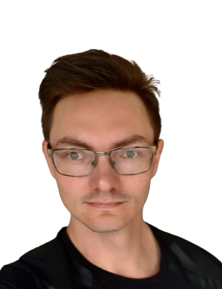
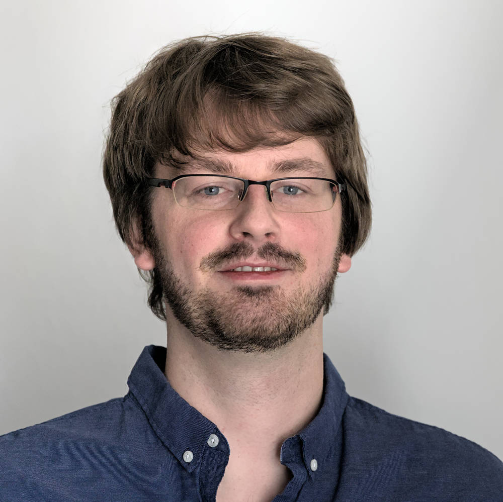

---

layout: wrapper

---

# GCCL Fellows

- [Dr. Gabriel B. Caminha](https://github.com/gbcaminha)   
  MPA   
  caminha@mpa-garching.mpg.de   
    

- [Dr. Matteo Cataneo](https://de.linkedin.com/in/matteo-cataneo-166b6799)   
  Bonn   
  mcataneo@uni-bonn.de    
  

- [Dr. Andrej Dvornik](https://andrej.dvrnk.si)  
GAFO 03 / 923  
  dvornik@astro.ruhr-uni-bochum.de  
  +49 234 3224224  
  

- [Dr. Anna Porredon](https://inspirehep.net/authors/1615417)  
GAFO 03 / 925  Marie Curie Fellow
  porredon@astro.ruhr-uni-bochum.de  
  +49 234 3223450  
  

- [Dr. Robert Reischke](https://github.com/rreischke)  
Bonn
  reischke@posteo.net  
    

- [Dr. Benjamin Stolzner](https://github.com/BStoelzner)
GAFO 03 / 924
  stoelzner@astro.rub.de  

- [Dr. Sandra Unruh](https://github.com/SandraUnruh)  
Bonn  
  sandra.unruh@uni-bonn.de  
  +49 228 736588  
    

- [Dr. Jan Luca van den Busch](https://github.com/jlvdb)   
GAFO 03 / 924  
  jlvdb@astro.rub.de  
  +49 234 3224063  
    
  
- [Dr. Angus H Wright](https://github.com/AngusWright)  
GAFO 03 / 923  
  awright@astro.ruhr-uni-bochum.de  
  +49 234 3224224  
    

- [Dr. Ziang Yan](http://yanzastro.github.io)  
GAFO 03 / 925  
  yanza21@astro.ruhr-uni-bochum.de  
  +49 234 3223450  
    

# GCCL Fellow Alumni

- [Dr. Fabian Kohlinger](https://de.linkedin.com/in/fabian-koehlinger)  
GCCL: 2019, now working in data science

- [Dr. Alex Malz](https://github.com/aimalz)  
GCCL: 2019-2022, now working at Carnegie Mellon University

- [Dr. Constance Mahony](https://github.com/crcmahony)
GCCL: 2020-2023, now working at Donostia International Physics Center (DIPC) and the Beecroft Institute for Particle Astrophysics and Cosmology (BIPAC) at the University of Oxford 
  

- [Dr. Alex Mead](https://alexander-mead.github.io)  
GCCL: 2021, 2022, 2023, now working in data science at digiLab
   

- [Dr. Yiping Shu](https://www.mpa-garching.mpg.de/person/109305/2377)   
GCCL: 2020-2022, now faculty at Purple Mountain Observatory 
   

- [Dr. Mijin Yoon](http://mijinyoon.github.io)   
GCCL: 2019-2023, now working at Leiden University
    