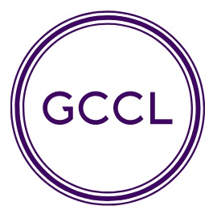

---

layout: wrapper

---

## Welcome to the German Centre for Cosmological Lensing!

At the GCCL our long-term goal is to answer one far-reaching question: what is the exact nature of the dark Universe?    We are currently building the methodology and techniques needed to analyse the two major international gravitational lensing surveys of the 2020’s: LSST and Euclid.  We are also developing new statistical tools to confront a range of different theories, on both dark matter and dark energy.

The German Centre for Cosmological Lensing (GCCL) was founded in November 2018 through the joint support of the[European Research Council](https://erc.europa.eu/), the [Max Planck Society](https://www.mpg.de/en), [the Alexander von Humboldt Foundation](https://www.humboldt-foundation.de/web/home.html) and the Federal Ministry of Education and Research.   The GCCL is based in the at the Astronomical Institute at the Ruhr-Universität Bochum, with [nodes](/nodes/) at the University of Bonn, the Max-Planck Institute for Astrophysics in Garching, Munich University Observatory and Heidelberg University..

We have four grant programmes;

- The [GCCL Fellowship programme](/fellows/) (the next call is anticipated in October 2020)
- Affiliate travel grants (travel between GCCL nodes)
- Workshop and conferences grants (hosted by GCCL nodes)
- International Distinguished visitor scheme 

For further information about any of these schemes, please [contact us](/contact/)

